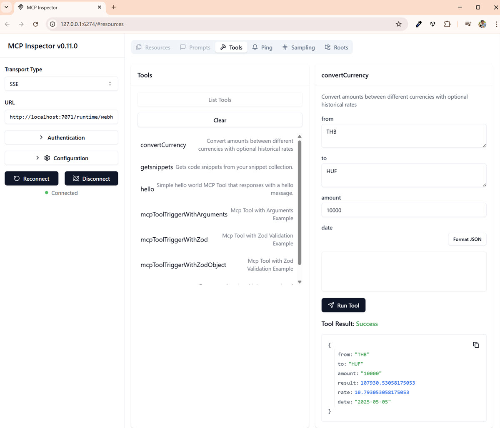

# Model Context Protocol (MCP) Demos

[Model Context Protocol (MCP)](https://modelcontextprotocol.io/introduction)

[MCP Servers](https://github.com/modelcontextprotocol/servers)

[Remote MCP with Azure Functions (.NET/C#)](https://learn.microsoft.com/en-us/samples/azure-samples/remote-mcp-functions-dotnet/remote-mcp-functions-dotnet/)

[Remote MCP with Azure Functions (Python)](https://learn.microsoft.com/en-us/samples/azure-samples/remote-mcp-functions-python/remote-mcp-functions-python/)

[Remote MCP with Azure Functions (Node.js/TypeScript/JavaScript)](https://learn.microsoft.com/en-us/samples/azure-samples/remote-mcp-functions-typescript/remote-mcp-functions-typescript/)

## Demo

> Note: Ensure [Azure Developer CLI](https://learn.microsoft.com/en-us/azure/developer/azure-developer-cli/install-azd) is installed

Clone the base repository while in beta:

```bash
azd init --template "https://github.com/azure-samples/remote-mcp-functions-typescript/tree/main/"
```

Implement your function

Run the function:

```bash
func start
```

Run MCP inspector:

```bash
npx @modelcontextprotocol/inspector node build/index.js
```

Use MCP inspector to inspect the function:


