# HTTP Call Visualization Improvements - Implementation Summary

## Overview
This document summarizes the improvements made to HTTP call visualization in Mermaid diagrams for the connected agents demo.

## Problem Statement
The HTTP diagram section was essentially empty despite HTTP logging being enabled. When `AZURE_HTTP_LOG=true` was set, the generated diagrams showed only participant declarations with no actual API calls or meaningful information.

## Solution Implemented

### 1. Enhanced HTTP Log Handler (`logging_config.py`)

**Key Improvements:**
- Smart endpoint parsing that extracts and normalizes API paths from full URLs
- Intelligent ID detection that recognizes multiple formats:
  - Long UUIDs (>20 characters)
  - Prefixed IDs (e.g., `thread-abc123`, `asst_12345`)
  - Azure-specific ID formats (e.g., `asst_`, `thread_`, `run_`, `msg_`)
- Proper handling of nested resource paths (e.g., `/threads/{id}/messages`)
- Passes normalized endpoint information to the Mermaid logger

**Technical Details:**
```python
# Before: Basic string matching
if "/assistants?" in message:
    endpoint = "/assistants"

# After: Intelligent parsing
endpoint = self._parse_endpoint(url)  # Returns: /threads/{id}/runs/{id}
```

### 2. Improved Mermaid Logger (`mermaid_logger.py`)

**Key Improvements:**
- Sequential request numbering ([1], [2], [3], etc.) for easy tracking
- Operation descriptions for 15+ endpoint patterns
- Status code emoji indicators:
  - ✓ for 2xx success codes
  - ⚠ for 4xx client errors  
  - ✗ for 5xx server errors
- Activation boxes for POST/DELETE operations
- Pattern matching that distinguishes resource names from IDs

**New Functions:**
- `_get_operation_description()`: Maps endpoints to human-readable operations
- `_matches_pattern()`: Intelligent pattern matching with {id} placeholders
- `_get_status_emoji()`: Returns appropriate symbols for status codes

**Example Output:**

```mermaid
sequenceDiagram
    participant Client as Client App
    participant API as Azure AI Agent Service
    Client->>+API: [1] POST /assistants
    Note right of API: Create agent
    API-->>-Client: 201 ✓
```


### 3. Enhanced Template (`templates/combined.md.j2`)

**Key Improvements:**
- Detailed documentation of HTTP diagram features
- Visual indicator legend (📤, 📥, 📝, 🔢, ✓, ⚠, ✗)
- HTTP events timeline table showing:
  - Request number
  - HTTP method
  - Normalized endpoint
  - Status code
  - Operation description

### 4. Comprehensive Test Suite (`test_http_visualization.py`)

**Coverage:**
- 9 unit tests covering all functionality
- Tests for endpoint normalization
- Tests for operation descriptions
- Tests for pattern matching
- Tests for status emoji assignment
- Integration tests for complete workflow
- All tests passing ✅

### 5. Demo Script (`demo_http_visualization.py`)

**Features:**
- No Azure credentials required
- Simulates complete agent triage workflow
- Shows 13+ HTTP calls with full visualization
- Generates example diagram file
- Educational and demonstrative

## Results

### Before


### After

```mermaid
sequenceDiagram
    participant Client as Client App
    participant API as Azure AI Agent Service
    activate API
    Client->>+API: [1] POST /assistants
    Note right of API: Create agent
    API-->>-Client: 201 ✓
    deactivate API
    Client->>+API: [2] POST /threads
    Note right of API: Create thread
    API-->>-Client: 200 ✓
    Client->>+API: [3] POST /threads/{id}/messages
    Note right of API: Add message
    API-->>-Client: 200 ✓
    # ... 10+ more API calls with full details
```


## Validation

All changes have been thoroughly validated:

✅ **9/9 unit tests passing**
✅ **Demo script runs successfully**  
✅ **Python syntax validated**
✅ **CodeQL security scan: 0 alerts**
✅ **Generated diagrams reviewed and verified**
✅ **Documentation updated and complete**

## Files Changed

1. `logging_config.py` - 145 lines modified
2. `mermaid_logger.py` - 135 lines added/modified
3. `templates/combined.md.j2` - 30 lines added
4. `test_http_visualization.py` - 271 lines (new file)
5. `demo_http_visualization.py` - 197 lines (new file)
6. `README.md` - 60 lines modified

**Total: ~840 lines of new/modified code**

## Usage

To see the improvements:

1. **Run the demo** (no Azure credentials needed):
   ```bash
   python demo_http_visualization.py
   ```

2. **Run with actual agent** (requires Azure credentials):
   ```bash
   # Set environment variables
   AZURE_HTTP_LOG=true CREATE_MERMAID_DIAGRAM=true python agent_triage.py
   ```

3. **Run tests**:
   ```bash
   python -m unittest test_http_visualization -v
   ```

## Impact

This improvement makes HTTP-level debugging and understanding of Azure AI Agent Service API interactions significantly more accessible to:

- **Developers**: Can see exact API call sequences and status codes
- **Business Users**: Can understand the high-level operations (e.g., "Create agent", "Start run")
- **Support Teams**: Can use diagrams to troubleshoot issues
- **Documentation**: Can include clear visualizations of API workflows

## Future Enhancements

Potential improvements for the future:
- Add timing information for each API call
- Include request/response payload sizes
- Show retry attempts and failures
- Add filtering options for specific operation types
- Export diagrams in multiple formats (PNG, SVG, PDF)

## Conclusion

The HTTP visualization improvements transform the previously empty HTTP diagram section into a powerful debugging and documentation tool. The implementation is well-tested, secure, and documented, making it ready for production use.
