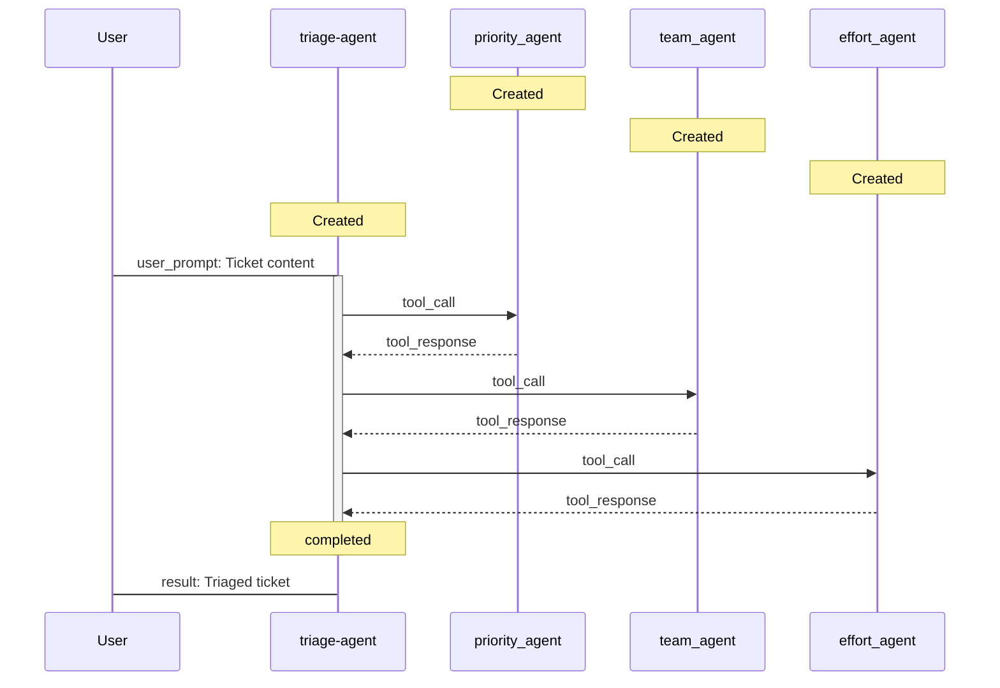

# Mermaid Diagram Generation

This feature allows you to collect agent interaction events and generate Mermaid sequence diagrams to visualize the agent workflow.

## Configuration

Enable Mermaid diagram generation by setting the environment variable in `.env`:

```
CREATE_MERMAID_DIAGRAM=true
```

## How It Works

When enabled, the `MermaidLogger` class collects events during agent execution:

- Agent creations
- Tool registrations  
- Message exchanges
- Agent run lifecycle (start/complete)

## Output

When the script completes, it automatically saves a Mermaid diagram to `agent_interactions.mmd` in the current directory.

## Viewing the Diagram

You can view the generated Mermaid diagram using:

1. **Online**: Copy the content of `agent_interactions.mmd` to https://mermaid.live/
2. **VS Code**: Install the "Mermaid Preview" extension
3. **GitHub**: Mermaid diagrams are automatically rendered in markdown files

## Example Diagram



## Verbose Mode

When `VERBOSE_OUTPUT=true` is also set, the MermaidLogger will output debug messages showing each event as it's collected.
