# TICKET-20251111_230548

**Description:** Users can't reset their password from the mobile app.

**Timestamp:** 2025-11-11 23:05:48

**Active Log Levels:** default, verbose, http

## Outcome

Your support ticket has been automatically analyzed and categorized. Our AI-powered triage system has:

✅ **Assessed the priority** of your issue to ensure urgent matters get immediate attention  
✅ **Identified the right team** to handle your request based on the technical area  
✅ **Estimated the effort** required so you know what to expect for resolution time  

**Analysis Result:**

Priority: High, Team: Frontend, Effort: Medium

The analysis is complete and your ticket has been routed to the appropriate team for action.

## Technical Process

The triage agent used connected agents as tools. Each specialized agent operates independently with its own instructions, while the main agent delegates tasks and aggregates responses.

**System Architecture:**
- **Priority Agent**: Assessed urgency based on impact and user-facing issues
- **Team Agent**: Determined optimal team assignment based on ticket content
- **Effort Agent**: Estimated required work and complexity

The main orchestrator agent coordinated these assessments to provide comprehensive triage results.

**Token Usage:**
- Input Tokens: 0
- Output Tokens: 0
- Total Tokens: 0

### Default Level - Agent Interaction Diagram

Sequence diagram showing the core message flow and run lifecycle between agents.

### Verbose Level - System Setup Flowchart

Flowchart showing agent creation, tool registration, and execution flow.

### HTTP Level - API Communication Layer

This section provides a detailed view of all HTTP requests and responses exchanged between the client application and the Azure AI Agent Service API. Each API call is numbered sequentially and includes the HTTP method, endpoint, operation description, and response status code.

**What you'll see:**
- 📤 **Outbound requests** from the client to the Azure AI service
- 📥 **Response status codes** with success/error indicators (✓ = success, ⚠ = client error, ✗ = server error)
- 📝 **Operation descriptions** explaining what each API call does
- 🔢 **Sequential numbering** to track the order of operations

```mermaid
sequenceDiagram
    participant Client as Client App
    participant API as Azure AI Agent Service
    activate API
    Client->>+API: [1] POST /assistants
    Note right of API: Create agent
    API-->>-Client: 201 ✓
    deactivate API
    activate API
    Client->>+API: [2] POST /assistants
    Note right of API: Create agent
    API-->>-Client: 201 ✓
    deactivate API
    activate API
    Client->>+API: [3] POST /assistants
    Note right of API: Create agent
    API-->>-Client: 201 ✓
    deactivate API
    activate API
    Client->>+API: [4] POST /assistants
    Note right of API: Create agent
    API-->>-Client: 201 ✓
    deactivate API
    activate API
    Client->>+API: [5] POST /threads
    Note right of API: Create thread
    API-->>-Client: 200 ✓
    deactivate API
    activate API
    Client->>+API: [6] POST /threads/{id}/messages
    Note right of API: Add message
    API-->>-Client: 200 ✓
    deactivate API
    activate API
    Client->>+API: [7] POST /threads/{id}/runs
    Note right of API: Start run
    API-->>-Client: 200 ✓
    deactivate API
    Client->>+API: [8] GET /threads/{id}/runs/{id}
    Note right of API: Get run status
    API-->>-Client: 200 ✓
    Client->>+API: [9] GET /threads/{id}/messages
    Note right of API: List messages
    API-->>-Client: 200 ✓
    activate API
    Client->>+API: [10] DELETE /assistants/{id}
    Note right of API: Delete agent
    API-->>-Client: 204 ✓
    deactivate API
    activate API
    Client->>+API: [11] DELETE /assistants/{id}
    Note right of API: Delete agent
    API-->>-Client: 204 ✓
    deactivate API
    activate API
    Client->>+API: [12] DELETE /assistants/{id}
    Note right of API: Delete agent
    API-->>-Client: 204 ✓
    deactivate API
    activate API
    Client->>+API: [13] DELETE /assistants/{id}
    Note right of API: Delete agent
    API-->>-Client: 204 ✓
    deactivate API
```

#### HTTP Events Timeline

The following table shows all HTTP requests in chronological order:

| # | Method | Endpoint | Status | Operation |
|---|--------|----------|--------|-----------|

| 2 | POST | /assistants | 201 | API call |

| 3 | POST | /assistants | 201 | API call |

| 4 | POST | /assistants | 201 | API call |

| 5 | POST | /assistants | 201 | API call |

| 6 | POST | /threads | 200 | API call |

| 7 | POST | /threads/{id}/messages | 200 | API call |

| 8 | POST | /threads/{id}/runs | 200 | API call |

| 9 | GET | /threads/{id}/runs/{id} | 200 | API call |

| 10 | GET | /threads/{id}/messages | 200 | API call |

| 11 | DELETE | /assistants/{id} | 204 | API call |

| 12 | DELETE | /assistants/{id} | 204 | API call |

| 13 | DELETE | /assistants/{id} | 204 | API call |

| 14 | DELETE | /assistants/{id} | 204 | API call |

