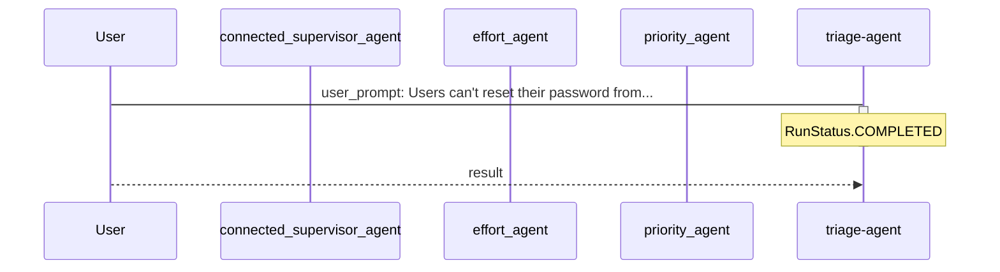
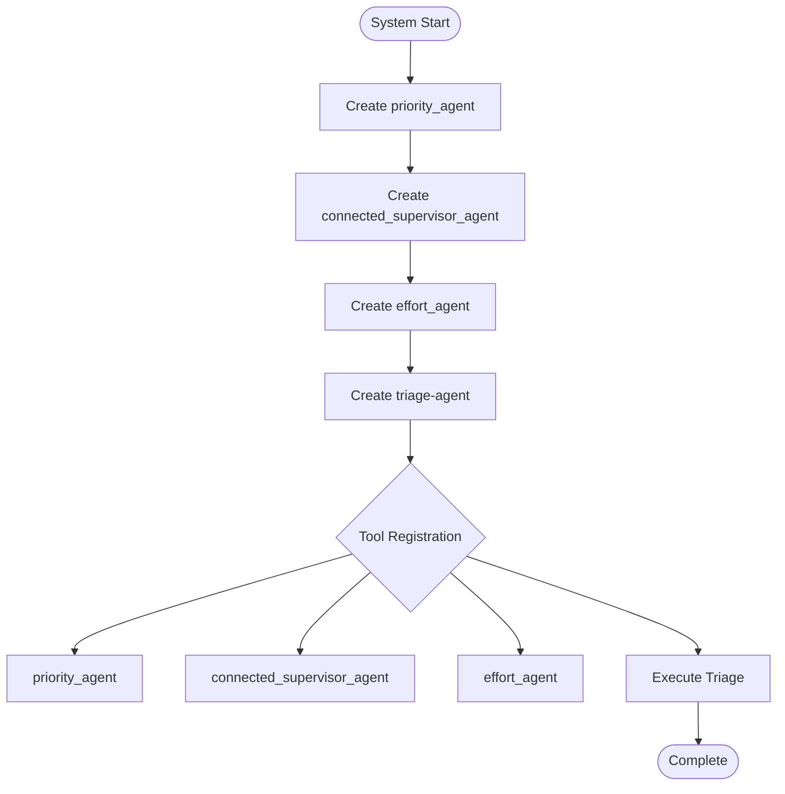
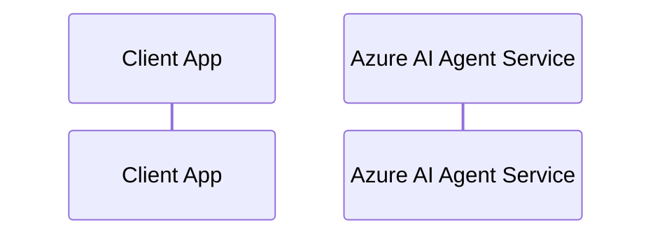

# TICKET-20251111_235406

**Description:** Users can't reset their password from the mobile app.

**Timestamp:** 2025-11-11 23:54:06

**Active Log Levels:** default, verbose, http

## Outcome

Your support ticket has been automatically analyzed and categorized. Our AI-powered triage system has:

✅ **Assessed the priority** of your issue to ensure urgent matters get immediate attention  
✅ **Identified the right team** to handle your request based on the technical area  
✅ **Estimated the effort** required so you know what to expect for resolution time  

**Analysis Result:**

Priority: **High**  
This issue is critical as it prevents users from accessing their accounts .

Assigned Team: **Backend**  
The problem likely involves server-side logic for password resets .

Effort Estimate: **Medium**  
Resolving this issue will likely require 2-3 days of work, as it involves both frontend and backend components, including code review, API integration, and testing .

The analysis is complete and your ticket has been routed to the appropriate team for action.

## Technical Process

The triage agent used connected agents as tools. Each specialized agent operates independently with its own instructions, while the main agent delegates tasks and aggregates responses.

**System Architecture:**
- **Priority Agent**: Assessed urgency based on impact and user-facing issues
- **Team Agent**: Determined optimal team assignment based on ticket content
- **Effort Agent**: Estimated required work and complexity

The main orchestrator agent coordinated these assessments to provide comprehensive triage results.

**Token Usage:**
- Input Tokens: 2028
- Output Tokens: 181
- Total Tokens: 2209

### Default Level - Agent Interaction Diagram

Sequence diagram showing the core message flow and run lifecycle between agents.

### Verbose Level - System Setup Flowchart

Flowchart showing agent creation, tool registration, and execution flow.

### HTTP Level - API Communication Layer

Detailed sequence diagram showing the complete HTTP request/response conversation between the client application and Azure AI Agent Service API, including all message exchanges and internal processing notes.

