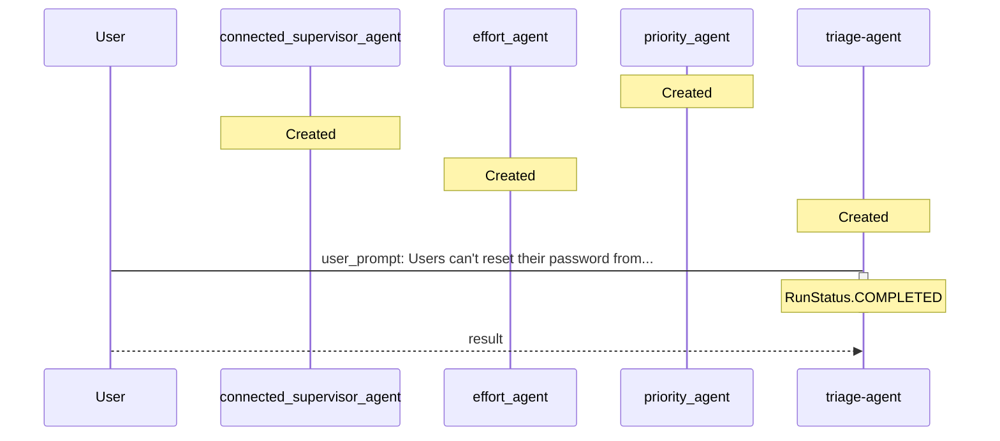

# TICKET-20251111_225816

**Description:** Users can't reset their password from the mobile app.

**Timestamp:** 2025-11-11 22:58:16

## Outcome

The ticket was processed through a multi-agent triage system. The main orchestrator agent delegated analysis to specialized agents for priority assessment, team assignment, and effort estimation. The results were combined to provide a comprehensive triage outcome.

### Agent Interaction Diagram

