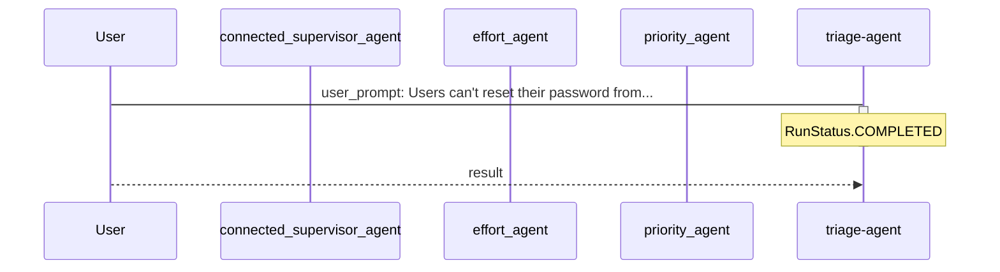

# TICKET-20251111_232448

**Description:** Users can't reset their password from the mobile app.

**Timestamp:** 2025-11-11 23:24:48

## Outcome

The ticket was processed through a multi-agent triage system where specialized agents analyzed different aspects:
- **Priority Agent**: Assessed urgency based on impact and user-facing issues
- **Team Agent**: Determined optimal team assignment based on ticket content
- **Effort Agent**: Estimated required work and complexity

The main orchestrator agent coordinated these assessments to provide comprehensive triage results.

## Technical Process

The triage agent used connected agents as tools. Each specialized agent operates independently with its own instructions, while the main agent delegates tasks and aggregates responses.

### Agent Interaction Diagram

