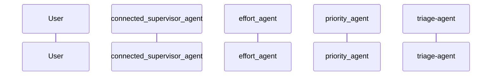

# TICKET-20251111_232448 - HTTP Communication Log

**Description:** Users can't reset their password from the mobile app.

**Timestamp:** 2025-11-11 23:24:48

## Outcome

The ticket was processed through a multi-agent triage system where specialized agents analyzed different aspects:
- **Priority Agent**: Assessed urgency based on impact and user-facing issues
- **Team Agent**: Determined optimal team assignment based on ticket content
- **Effort Agent**: Estimated required work and complexity

The main orchestrator agent coordinated these assessments to provide comprehensive triage results.

## HTTP Communication Analysis

This diagram focuses on HTTP-level communication patterns between the client and Azure AI Agent Service, including API calls, requests, and responses.

### HTTP Interaction Diagram

### HTTP Events Summary

The following HTTP-level events were captured:

- **2025-11-11T23:24:30.294701**: API call: User → triage-agent
  
  - Details: user_prompt: Users can't reset their password from the mobile app.
  

- **2025-11-11T23:24:47.748372**: API call: triage-agent → User
  
  - Details: result: ### Triage Summary

- **Priority:** High  
  This issue is a user-facing blocking problem that prevents users from accessing the app, necessitating immediate attention .

- **Assigned Team:** Backend  
  The issue likely involves server-side processes related to the password reset functionality, which need to be resolved by the backend team .

- **Effort Required:** Medium  
  The resolution will involve both front-end changes in the mobile app and back-end adjustments, with an estimated effort level of 2-3 days for implementation and testing .
  

