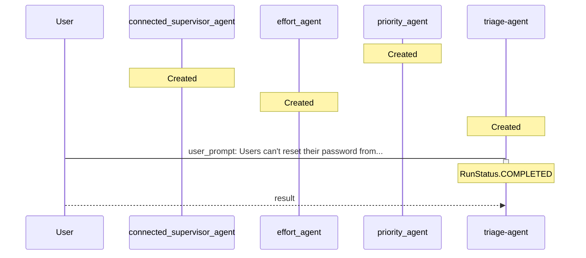

# TICKET-20251111_232448 - Verbose Analysis

**Description:** Users can't reset their password from the mobile app.

**Timestamp:** 2025-11-11 23:24:48

## Outcome

The ticket was processed through a multi-agent triage system where specialized agents analyzed different aspects:
- **Priority Agent**: Assessed urgency based on impact and user-facing issues
- **Team Agent**: Determined optimal team assignment based on ticket content
- **Effort Agent**: Estimated required work and complexity

The main orchestrator agent coordinated these assessments to provide comprehensive triage results.

## Technical Process (Verbose)

The triage agent used connected agents as tools. Each specialized agent operates independently with its own instructions, while the main agent delegates tasks and aggregates responses.

### Detailed Agent Interaction Flow

This verbose diagram includes additional details about agent creation, tool registration, and internal processing steps that are typically hidden in the default view.

### Event Log

The following events were captured during processing:

- **agent_creation** at 2025-11-11T23:24:28.475930
  
  - Agent: priority_agent (ID: asst_4UugcTyvsHdHc37WmbCFcmnt)
  

- **agent_creation** at 2025-11-11T23:24:28.783610
  
  - Agent: connected_supervisor_agent (ID: asst_V02UPboZN38NPLsCOdl0HbY6)
  

- **agent_creation** at 2025-11-11T23:24:29.022145
  
  - Agent: effort_agent (ID: asst_3nXATkFKwiD1qHCllQgYV9vG)
  

- **agent_creation** at 2025-11-11T23:24:29.253377
  
  - Agent: triage-agent (ID: asst_9qGOdhsVwu0F3ceuu7fEctHx)
  

- **tool_registration** at 2025-11-11T23:24:29.253377
  
  - Tool: priority_agent registered with triage-agent
  

- **tool_registration** at 2025-11-11T23:24:29.253377
  
  - Tool: connected_supervisor_agent registered with triage-agent
  

- **tool_registration** at 2025-11-11T23:24:29.253377
  
  - Tool: effort_agent registered with triage-agent
  

- **message** at 2025-11-11T23:24:30.294701
  
  - From: User → To: triage-agent (user_prompt)
    - Content: Users can't reset their password from the mobile app.
  

- **run_started** at 2025-11-11T23:24:30.294701
  
  - Agent: triage-agent on thread thread_XmmOY6qGeFIZ74dEXc8taA2b
  

- **run_completed** at 2025-11-11T23:24:47.419218
  
  - Agent: triage-agent (Status: RunStatus.COMPLETED)
  

- **message** at 2025-11-11T23:24:47.748372
  
  - From: triage-agent → To: User (result)
    - Content: ### Triage Summary

- **Priority:** High  
  This issue is a user-facing blocking problem that prevents users from accessing the app, necessitating immediate attention .

- **Assigned Team:** Backend  
  The issue likely involves server-side processes related to the password reset functionality, which need to be resolved by the backend team .

- **Effort Required:** Medium  
  The resolution will involve both front-end changes in the mobile app and back-end adjustments, with an estimated effort level of 2-3 days for implementation and testing .
  

