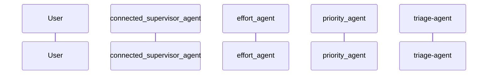

# TICKET-20251112_002553 - HTTP Communication Log

**Description:** Users can't reset their password from the mobile app.

**Timestamp:** 2025-11-12 00:25:53

## Outcome

The ticket was processed through a multi-agent triage system where specialized agents analyzed different aspects:
- **Priority Agent**: Assessed urgency based on impact and user-facing issues
- **Team Agent**: Determined optimal team assignment based on ticket content
- **Effort Agent**: Estimated required work and complexity

The main orchestrator agent coordinated these assessments to provide comprehensive triage results.

## HTTP Communication Analysis

This diagram focuses on HTTP-level communication patterns between the client and Azure AI Agent Service, including API calls, requests, and responses.

### HTTP Interaction Diagram

### HTTP Events Summary

The following HTTP-level events were captured:

- **2025-11-12T00:25:43.531606**: API call: User → triage-agent
  
  - Details: user_prompt: Users can't reset their password from the mobile app.
  

- **2025-11-12T00:25:53.224588**: API call: triage-agent → User
  
  - Details: result: The ticket regarding users being unable to reset their passwords from the mobile app has been triaged as follows:

- **Priority:** High. This issue is user-facing and prevents access, which necessitates prompt attention .
- **Assigned Team:** Frontend. The problem relates to the mobile app's user interface and functionality for password resets .
- **Effort Level:** Medium. The resolution is expected to involve debugging, reviewing code, ensuring proper API integration, and possibly making adjustments to the user interface, with an estimated completion time of 2-3 days . 

This information should assist the team in addressing the issue effectively.
  

