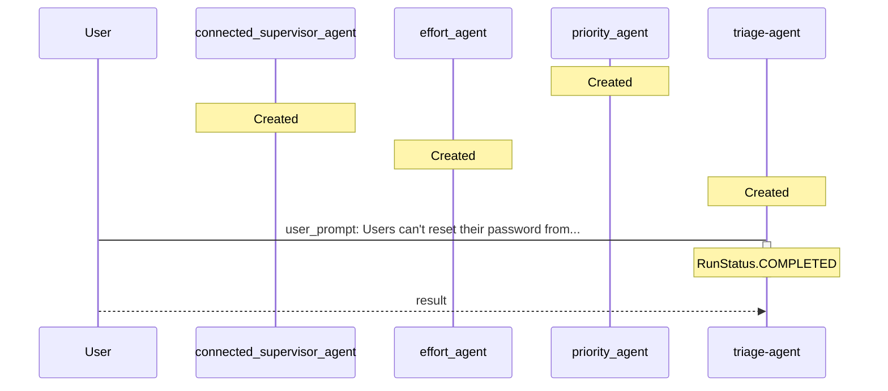

# TICKET-20251112_002553 - Verbose Analysis

**Description:** Users can't reset their password from the mobile app.

**Timestamp:** 2025-11-12 00:25:53

## Outcome

The ticket was processed through a multi-agent triage system where specialized agents analyzed different aspects:
- **Priority Agent**: Assessed urgency based on impact and user-facing issues
- **Team Agent**: Determined optimal team assignment based on ticket content
- **Effort Agent**: Estimated required work and complexity

The main orchestrator agent coordinated these assessments to provide comprehensive triage results.

## Technical Process (Verbose)

The triage agent used connected agents as tools. Each specialized agent operates independently with its own instructions, while the main agent delegates tasks and aggregates responses.

### Detailed Agent Interaction Flow

This verbose diagram includes additional details about agent creation, tool registration, and internal processing steps that are typically hidden in the default view.

### Event Log

The following events were captured during processing:

- **agent_creation** at 2025-11-12T00:25:42.356596
  
  - Agent: priority_agent (ID: asst_zCYsUWREwv1np5LUoLOf5ufB)
  

- **agent_creation** at 2025-11-12T00:25:42.634705
  
  - Agent: connected_supervisor_agent (ID: asst_16Bqx7FNaNSsrnA0T4CNDNtw)
  

- **agent_creation** at 2025-11-12T00:25:42.867172
  
  - Agent: effort_agent (ID: asst_EmC7CYHenhxtQHF4XFpGRO6m)
  

- **agent_creation** at 2025-11-12T00:25:43.079188
  
  - Agent: triage-agent (ID: asst_EV8IZts0SLDfLi4bbSTqJFEK)
  

- **tool_registration** at 2025-11-12T00:25:43.079188
  
  - Tool: priority_agent registered with triage-agent
  

- **tool_registration** at 2025-11-12T00:25:43.079188
  
  - Tool: connected_supervisor_agent registered with triage-agent
  

- **tool_registration** at 2025-11-12T00:25:43.079188
  
  - Tool: effort_agent registered with triage-agent
  

- **message** at 2025-11-12T00:25:43.531606
  
  - From: User → To: triage-agent (user_prompt)
    - Content: Users can't reset their password from the mobile app.
  

- **run_started** at 2025-11-12T00:25:43.531606
  
  - Agent: triage-agent on thread thread_YInvOgIvfS6K8ji0fuShSTpx
  

- **run_completed** at 2025-11-12T00:25:52.549168
  
  - Agent: triage-agent (Status: RunStatus.COMPLETED)
  

- **message** at 2025-11-12T00:25:53.224588
  
  - From: triage-agent → To: User (result)
    - Content: The ticket regarding users being unable to reset their passwords from the mobile app has been triaged as follows:

- **Priority:** High. This issue is user-facing and prevents access, which necessitates prompt attention .
- **Assigned Team:** Frontend. The problem relates to the mobile app's user interface and functionality for password resets .
- **Effort Level:** Medium. The resolution is expected to involve debugging, reviewing code, ensuring proper API integration, and possibly making adjustments to the user interface, with an estimated completion time of 2-3 days . 

This information should assist the team in addressing the issue effectively.
  

