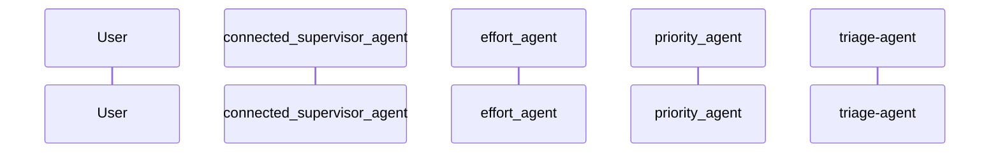

# TICKET-20251112_071642 - HTTP Communication Log

**Description:** Users can't reset their password from the mobile app.

**Timestamp:** 2025-11-12 07:16:42

## Outcome

The ticket was processed through a multi-agent triage system where specialized agents analyzed different aspects:
- **Priority Agent**: Assessed urgency based on impact and user-facing issues
- **Team Agent**: Determined optimal team assignment based on ticket content
- **Effort Agent**: Estimated required work and complexity

The main orchestrator agent coordinated these assessments to provide comprehensive triage results.

## HTTP Communication Analysis

This diagram focuses on HTTP-level communication patterns between the client and Azure AI Agent Service, including API calls, requests, and responses.

### HTTP Interaction Diagram

### HTTP Events Summary

The following HTTP-level events were captured:

- **2025-11-12T07:16:32.858040**: API call: User → triage-agent
  
  - Details: user_prompt: Users can't reset their password from the mobile app.
  

- **2025-11-12T07:16:42.294342**: API call: triage-agent → User
  
  - Details: result: The triage results for the ticket "Users can't reset their password from the mobile app" are as follows:

- **Priority**: High. This issue is blocking users from accessing their accounts, which significantly impacts their ability to use the app .
- **Assigned Team**: Backend. The issue pertains to user authentication and account management, areas typically handled by the backend team .
- **Effort Level**: Medium. Implementing the password reset functionality may take around 2-3 days, considering the need for backend services, mobile client integration, end-to-end testing, and necessary security measures .
  

