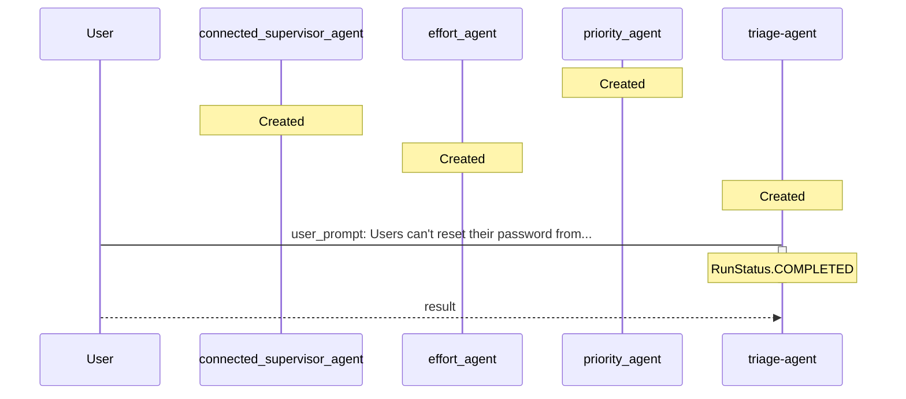

# TICKET-20251112_071642 - Verbose Analysis

**Description:** Users can't reset their password from the mobile app.

**Timestamp:** 2025-11-12 07:16:42

## Outcome

The ticket was processed through a multi-agent triage system where specialized agents analyzed different aspects:
- **Priority Agent**: Assessed urgency based on impact and user-facing issues
- **Team Agent**: Determined optimal team assignment based on ticket content
- **Effort Agent**: Estimated required work and complexity

The main orchestrator agent coordinated these assessments to provide comprehensive triage results.

## Technical Process (Verbose)

The triage agent used connected agents as tools. Each specialized agent operates independently with its own instructions, while the main agent delegates tasks and aggregates responses.

### Detailed Agent Interaction Flow

This verbose diagram includes additional details about agent creation, tool registration, and internal processing steps that are typically hidden in the default view.

### Event Log

The following events were captured during processing:

- **agent_creation** at 2025-11-12T07:16:31.439321
  
  - Agent: priority_agent (ID: asst_dCDarMMDe9uUeAVtCeskmRxi)
  

- **agent_creation** at 2025-11-12T07:16:31.745222
  
  - Agent: connected_supervisor_agent (ID: asst_zmb7cN4DO6oL4JZuJD9aDmzL)
  

- **agent_creation** at 2025-11-12T07:16:32.013539
  
  - Agent: effort_agent (ID: asst_oSEfwdMXCnEXT5t3py77Wpv6)
  

- **agent_creation** at 2025-11-12T07:16:32.233756
  
  - Agent: triage-agent (ID: asst_AcD0dLRTq2t5s1xLFk1l5fwx)
  

- **tool_registration** at 2025-11-12T07:16:32.233756
  
  - Tool: priority_agent registered with triage-agent
  

- **tool_registration** at 2025-11-12T07:16:32.233756
  
  - Tool: connected_supervisor_agent registered with triage-agent
  

- **tool_registration** at 2025-11-12T07:16:32.233756
  
  - Tool: effort_agent registered with triage-agent
  

- **message** at 2025-11-12T07:16:32.858040
  
  - From: User → To: triage-agent (user_prompt)
    - Content: Users can't reset their password from the mobile app.
  

- **run_started** at 2025-11-12T07:16:32.858040
  
  - Agent: triage-agent on thread thread_vMuh6vscgEpManrRq824TZZC
  

- **run_completed** at 2025-11-12T07:16:42.013913
  
  - Agent: triage-agent (Status: RunStatus.COMPLETED)
  

- **message** at 2025-11-12T07:16:42.294342
  
  - From: triage-agent → To: User (result)
    - Content: The triage results for the ticket "Users can't reset their password from the mobile app" are as follows:

- **Priority**: High. This issue is blocking users from accessing their accounts, which significantly impacts their ability to use the app .
- **Assigned Team**: Backend. The issue pertains to user authentication and account management, areas typically handled by the backend team .
- **Effort Level**: Medium. Implementing the password reset functionality may take around 2-3 days, considering the need for backend services, mobile client integration, end-to-end testing, and necessary security measures .
  

