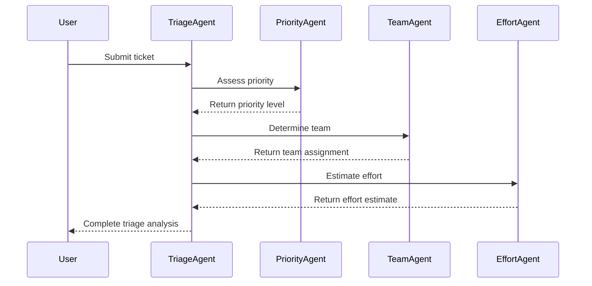
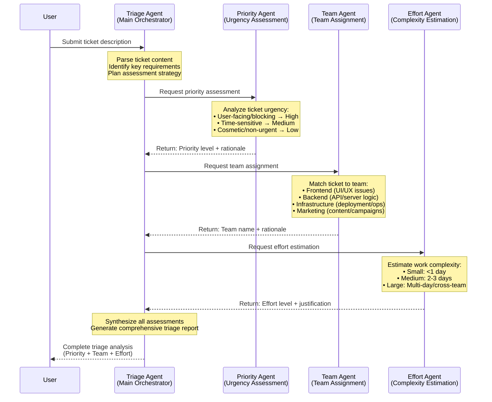

# Ticket 20251115_182457

## Ticket Description
- **Description**: Users can't reset their password from the mobile app.
- **Resolution**: 1. **Priority:** High - This is a significant issue as it affects user access and functionality in the mobile app.

2. **Team:** Backend - The password reset functionality typically involves server-side logic and database interactions, which fall under the backend team's responsibilities.

3. **Effort Required:** Medium - While the issue is critical, resolving it may involve debugging current processes, ensuring security protocols are in place, and possibly updating the app or backend services.

**Summary:**
- **Priority:** High
- **Team:** Backend
- **Effort Required:** Medium
- **Token Usage**: In: 0, Out: 0, Total: 0

## Diagram

## Verbose Diagram

