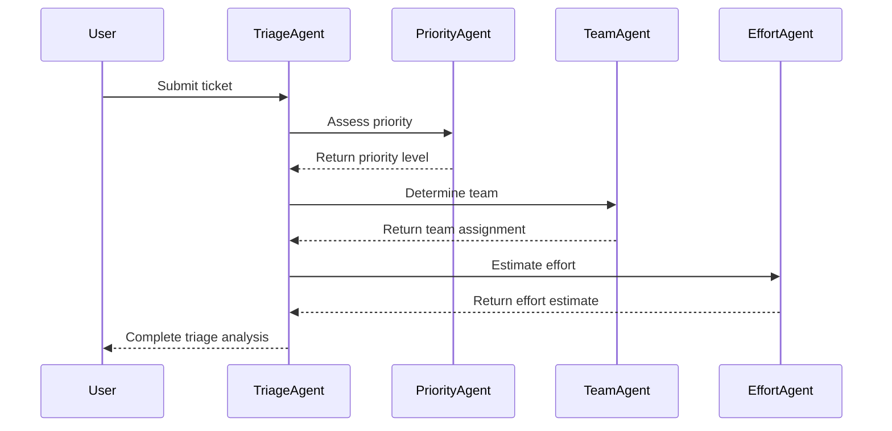
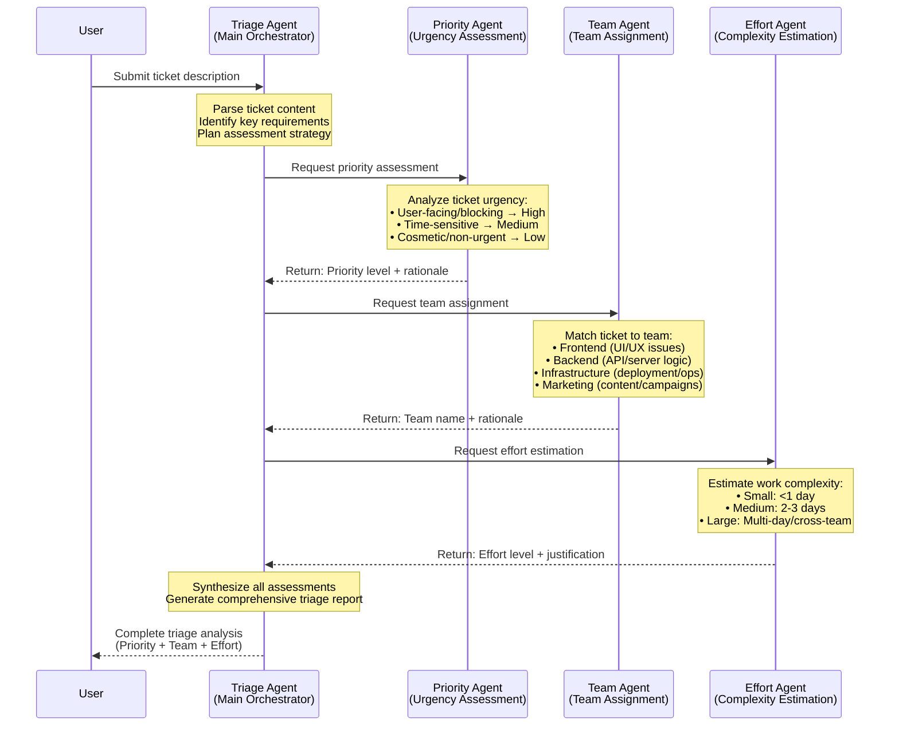

# Ticket 20251112_193930

## Ticket Description
- **Description**: Create an expense claim for the following expenses: date,description,amount
              07-Mar-2025,taxi,24.00
              07-Mar-2025,dinner,65.50
              07-Mar-2025,hotel,125.90
- **Resolution**: Here’s the summary of your expense claim:

**Itemized Expenses:**
- Date: 07-Mar-2025, Description: Taxi, Amount: $24.00
- Date: 07-Mar-2025, Description: Dinner, Amount: $65.50
- Date: 07-Mar-2025, Description: Hotel, Amount: $125.90

**Total Amount: $215.40**

Your expense claim has been formatted as requested.
- **Token Usage**: In: 0, Out: 0, Total: 0

## Diagram

## Verbose Diagram

