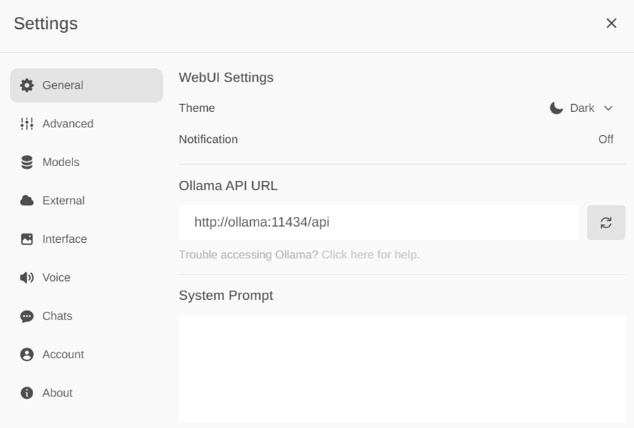
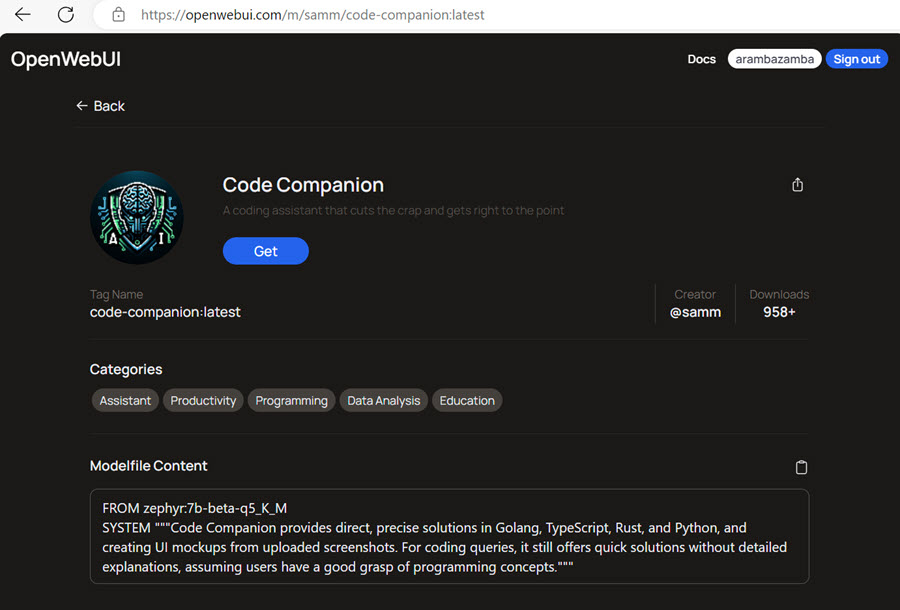
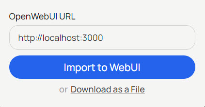
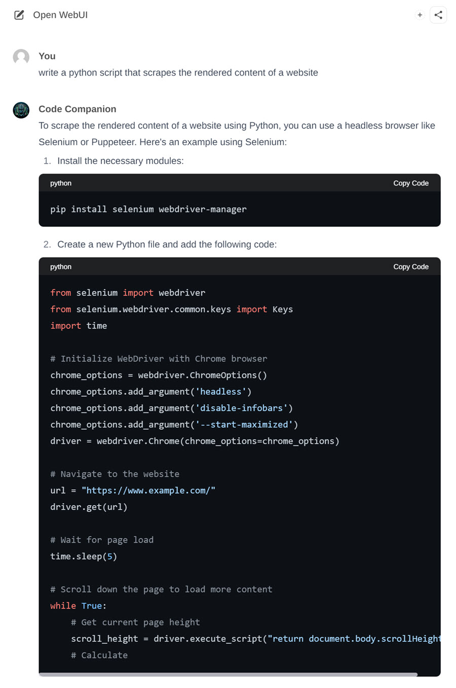

# Using Ollama WebUI

## Setup Ollama WebUI

- Clone the Ollama WebUI repository:

    ```bash
    git clone https://github.com/ollama-webui/ollama-webui
    ```

- Run Ollama WebUI (with build):

    ```bash
    docker compose up
    docker compose up -d --build
    ```

- Check if Ollama is running:

    ```bash
    http://127.0.0.1:11434
    ```

- Open Ollama in a browser:

    ```bash
    http://localhost:3000
    ```

    >Note: You might have to register a new user and login to use Ollama.

    

- Set `Ollama API URL` in the settings of Ollama WebUI.

        

- Select a model from https://ollamahub.com/. In this example, we will use the `mistral` model.

    


## Load a custom model from Ollama Hub

- Visit https://ollamahub.com/ and select a model and click on `Get`.

    

- Ensure that WebUI is running, add the OpenWebUI URL and click `Import to WebUI`.

    

- Select and test the model:

    